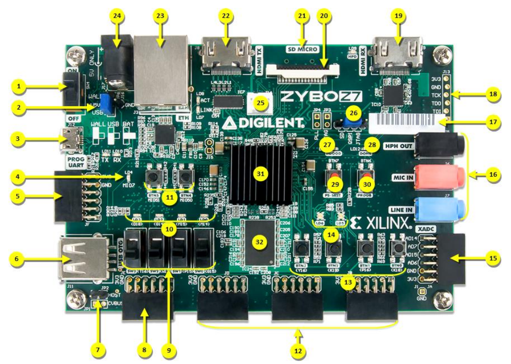

# Memulai
## Papan Zybo Z7

Zybo Z7 adalah papan pengembangan serbaguna yang didukung oleh chip Xilinx Zynq-7000. Papan ini mencakup berbagai antarmuka dan fitur, membuatnya menjadi pilihan yang sangat baik untuk proyek mulai dari sistem tertanam hingga percepatan perangkat keras. Berikut adalah penjelasan lengkap untuk setiap komponen yang terdaftar.

| **Nomor** | **Komponen**                      | **Deskripsi**                                                                 |
|-----------|----------------------------------|-------------------------------------------------------------------------------|
| 1         | Sakelar Daya                     | Sakelar utama untuk menyalakan atau mematikan papan.                         |
| 2         | Jumper Pilihan Daya             | Memilih mode pasokan daya: USB atau adaptor daya eksternal.                 |
| 3         | Port USB JTAG/UART              | Menggabungkan antarmuka JTAG dan komunikasi UART untuk pemrograman & debugging.|
| 4         | LED MIO Pengguna                | LED yang dapat diprogram yang terhubung ke pin MIO Zynq.                     |
| 5         | Port MIO Pmod                   | Antarmuka untuk modul Pmod yang menggunakan pin MIO.                        |
| 6         | Port USB 2.0 Host/OTG           | Mendukung mode USB 2.0 host dan On-The-Go (OTG).                            |
| 7         | Jumper Daya USB Host            | Mengaktifkan atau menonaktifkan daya USB saat dalam mode host.              |
| 8         | Port Pmod Standar               | Antarmuka Pmod serbaguna yang terhubung ke pin PL Zynq.                     |
| 9         | LED Pengguna                    | Empat LED yang dapat diprogram untuk indikator status atau debugging.        |
| 10        | Tombol Pengguna                 | Empat tombol fisik untuk input selama pengembangan atau operasi.            |
| 11        | Port Pmod Kecepatan Tinggi      | Port Pmod khusus untuk komunikasi kecepatan tinggi.                         |
| 12        | LED RGB Pengguna                | Dua LED RGB yang dapat diprogram, masing-masing dengan tiga saluran warna.  |
| 13        | Port Pmod XADC                  | Port Pmod yang terhubung ke pin XADC Zynq untuk input/output analog.         |
| 14        | Port Codec Audio                | Port untuk audio input/output seperti MIC IN, LINE IN, dan HEADPHONE OUT.   |
| 15        | Tombol Reset Codec Audio        | Mereset perangkat keras codec audio.                                        |
| 16        | Port JTAG Eksternal             | Antarmuka JTAG khusus untuk pemrograman FPGA atau prosesor.                 |
| 17        | Label Alamat MAC Unik           | Label yang berisi alamat MAC Ethernet unik untuk papan ini.                 |
| 18        | Port Input HDMI                 | Menerima sinyal input HDMI untuk pemrosesan video.                          |
| 19        | Port Pcam MIPI CSI-2            | Untuk menghubungkan kamera yang mendukung standar MIPI CSI-2.               |
| 20        | Konektor MicroSD                | Slot kartu microSD untuk booting atau penyimpanan data.                     |
| 21        | Port Output HDMI                | Mengirim sinyal HDMI dari logika FPGA atau prosesor Zynq.                   |
| 22        | Port Ethernet                   | Konektor RJ45 standar untuk komunikasi Ethernet.                            |
| 23        | Konektor Daya Eksternal         | Konektor untuk adaptor daya eksternal 5V DC.                                |
| 24        | Konektor Kipas (5V, Tiga Kabel) | Menyediakan koneksi 5V untuk kipas dengan output tachometer.                |
| 25        | Jumper Pemilihan Mode Program   | Mengatur mode pemrograman: JTAG atau QSPI/microSD untuk booting.            |
| 26        | LED Daya Stabil                 | Menyala jika daya yang diterima stabil.                                     |
| 27        | LED FPGA Selesai Diprogram      | Menyala jika konfigurasi FPGA berhasil dimuat.                              |
| 28        | Tombol Reset Prosesor           | Mereset subsistem prosesor pada chip Zynq.                                  |
| 29        | Tombol Hapus Konfigurasi FPGA   | Menghapus konfigurasi yang saat ini diisi ke dalam FPGA.                    |
| 30        | Chip Zynq-7000                  | SoC yang kuat menggabungkan prosesor ARM Cortex-A9 dengan logika FPGA.      |
| 31        | Memori DDR3L                    | RAM DDR3L onboard untuk penyimpanan sistem pemrosesan yang cepat.           |

---
## Instalasi Vivado && Vitis

---
## Memilih mode pada papan
1. **Menghidupkan Papan:**
   - Gunakan sakelar daya (1) untuk menyalakan papan setelah menghubungkan sumber daya melalui jumper pilihan daya (2).

2. **Memprogram FPGA:**
   - Gunakan port USB JTAG (3) atau port JTAG eksternal (16) untuk memprogram FPGA.
   - Konfirmasikan pemrograman berhasil dengan memeriksa "LED FPGA Selesai Diprogram" (27).

3. **Menguji Periferal:**
   - Hubungkan periferal seperti HDMI (18, 21), modul Pmod (8, 11, 13), atau kamera (19) sesuai kebutuhan aplikasi.

4. **Pilihan Boot:**
   - Atur mode pemrograman menggunakan jumper (25) dan pastikan gambar boot siap (misalnya, pada kartu microSD di port 20).

5. **Menggunakan Chip Zynq:**
   - Kembangkan dan terapkan perangkat lunak pada prosesor ARM di dalam chip Zynq (30) untuk fungsi yang lebih lanjut.
---
## Referensi
- [Panduan Referensi Zybo Z7](https://digilent.com/reference)
